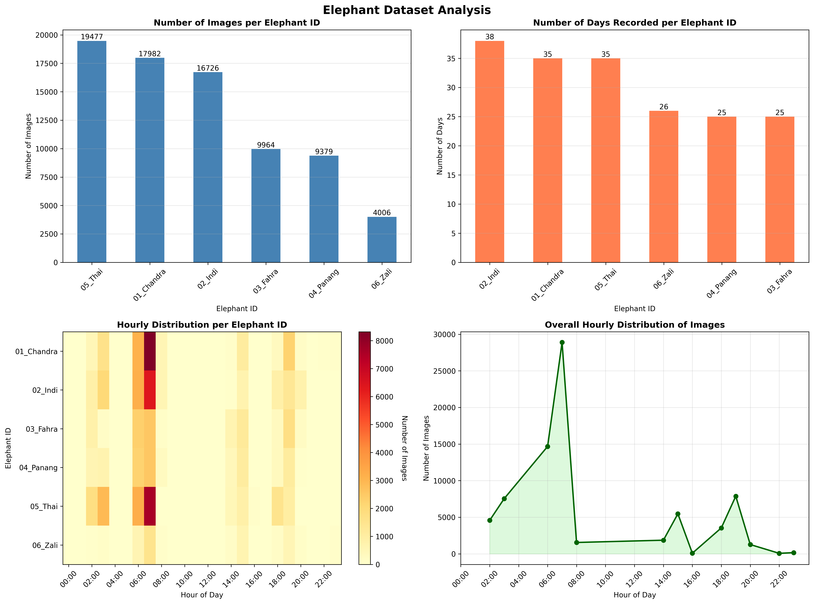
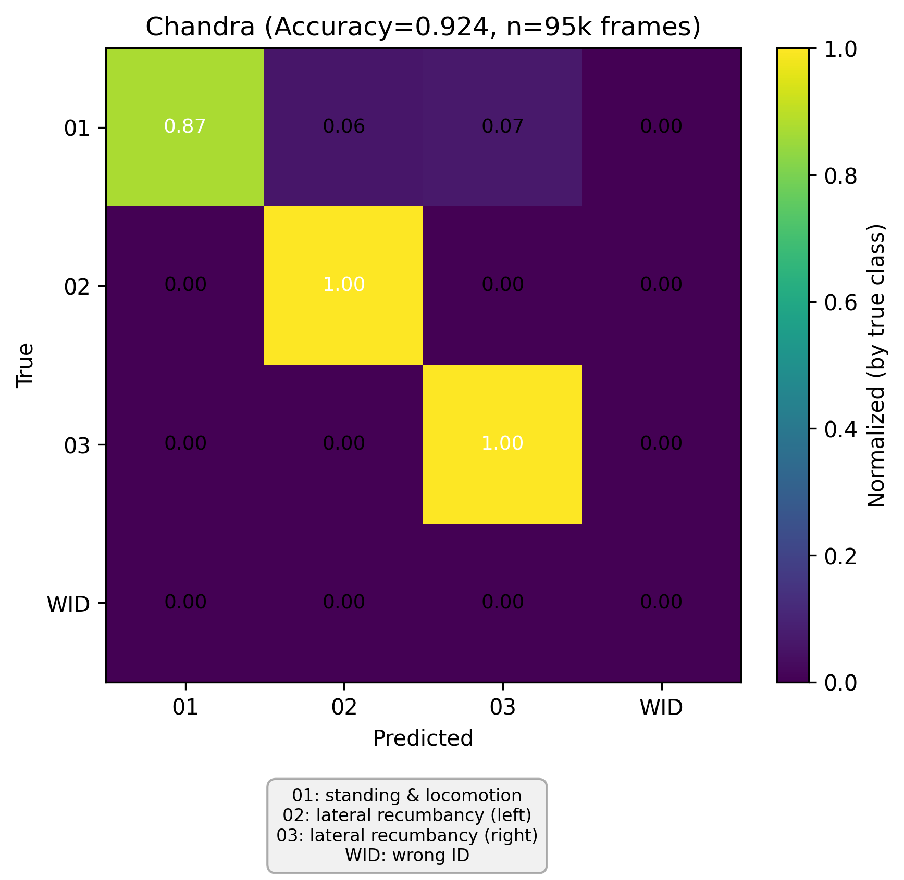
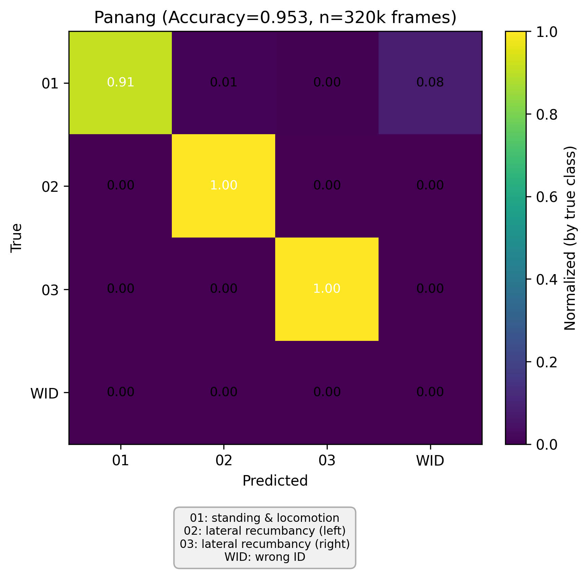
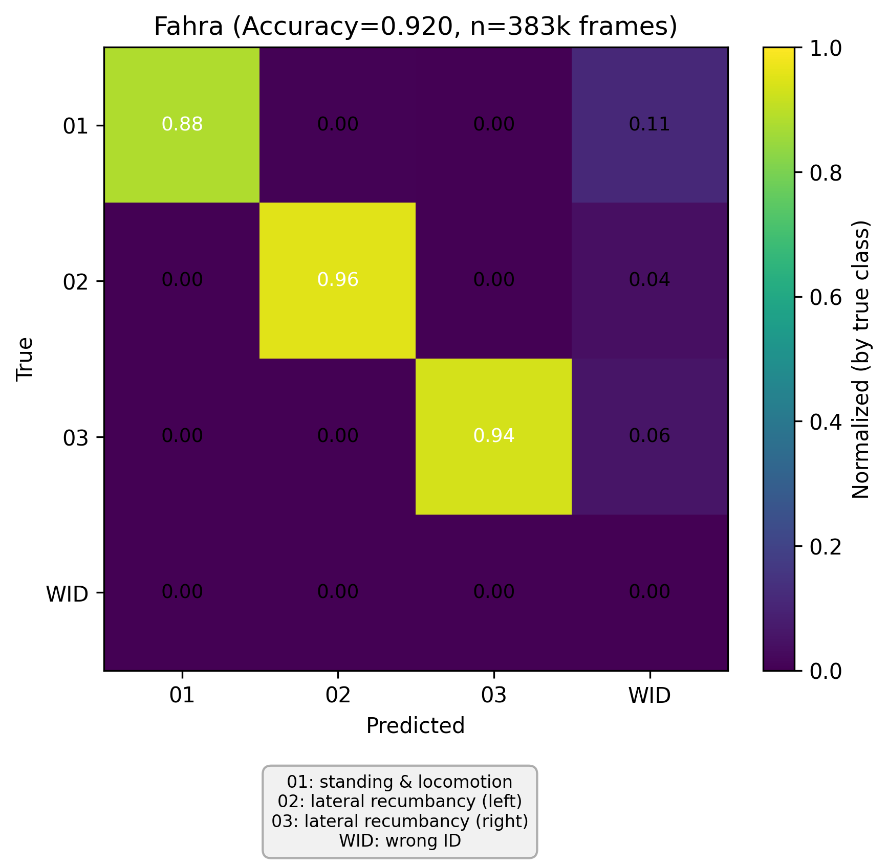

# Methods

## 2.1 Overview

We developed an automated video-based system for continuous monitoring of elephant behaviour and individual identification in indoor enclosures at Zoo Zürich. The system integrates four IP cameras — two per enclosure (Enclosure 1: cameras 016 and 019, without pool; Enclosure 2: cameras 017 and 018, with pool) — and processes video recordings through a two-stage computational pipeline. The first stage is **online tracking**, which performs real-time (or offline on historical recordings) elephant detection and multi-object tracking on each camera independently, producing per-camera tracklets with bounding boxes and timestamps. The second stage is **post-processing**, which refines the raw tracking output through four components: (1) behaviour classification, (2) individual re-identification, (3) multi-camera tracklet association, and (4) temporal data smoothing. Together, these stages yield identity-labelled, per-second behavioural annotations used to compute activity budgets, sleep bout statistics, laterality indices, and sleep synchrony metrics for five Asian elephants (Chandra, Indi, Fahra, Panang, and Thai).

All deep learning models were trained and evaluated on custom-labelled datasets collected from the same camera installation. Video frames were recorded at 25 frames per second (fps) at a resolution of 1920 × 1080 pixels. The nightly observation window spanned from 18:00 to 08:00 the following morning.

---

## 2.2 Elephant Detection and Tracking

### 2.2.1 Model Architecture

We employed YOLOv11-medium for segmentation (YOLOv11m-seg; [REF_YOLO]) as the detection backbone....

### 2.2.2 Training

### 2.2.3 Inference

---

## 2.3 Behaviour Classification

### 2.3.1 Model Architecture

Behaviour was classified using a dual-head convolutional neural network built on a shared Swin Transformer base backbone (Swin-B; [REF_SWIN]). The Swin-B backbone (patch size 4, window size 7, input resolution 224 × 224 pixels) was initialised from ImageNet-22k pretrained weights and served as a shared feature extractor for two independent linear classification heads:

- **Behaviour head** (4 classes): invalid/background (`00_invalid`), standing (`01_standing`), lateral recumbency on left side (`02_sleeping_left`), lateral recumbency on right side (`03_sleeping_right`).
- **Quality head** (2 classes): good image quality (`good`), poor image quality (`bad`).

The quality head provided an auxiliary signal for detecting low-quality crops (e.g., partial occlusions, motion blur), enabling downstream filtering. Images assigned to the `00_invalid` class were automatically labelled as `bad` quality during training, while all valid behaviour classes were labelled as `good` quality.

### 2.3.2 Training Data and Augmentation

Training images consisted of cropped elephant bounding boxes extracted from the tracking pipeline, organised into four class directories (`00_invalid`, `01_standing`, `02_sleeping_left`, `03_sleeping_right`). Training data were pooled from three annotation rounds (sleep_v1, sleep_v2, sleep_v5; total 2,490 images), and an independent annotation round (sleep_v4; 69 images) was reserved for validation. The per-class distribution of the training set was: `00_invalid` 281, `01_standing` 1,325, `02_sleeping_left` 440, `03_sleeping_right` 444 images. The standing class was notably overrepresented relative to the sleeping classes (approximately 3:1 ratio).

During training, the following data augmentation pipeline was applied:

1. **Geometric transforms**: longest-side resize to 224 pixels with zero-padding; random resized crop (scale 0.80–1.0, aspect ratio 0.90–1.10); shift-scale-rotate (shift ±2%, scale ±8%, rotation ±5°, probability 0.6).
2. **Photometric transforms**: random brightness and contrast adjustment (±20%, probability 0.7); random gamma correction (range 80–120, probability 0.4).
3. **Noise and degradation**: Gaussian noise (variance 10–60, probability 0.45); motion blur (kernel size 3, probability 0.15); Gaussian blur (kernel size 3, probability 0.15); JPEG compression (quality 40–95, probability 0.35).
4. **Normalisation**: ImageNet channel-wise normalisation (mean = [0.485, 0.456, 0.406], standard deviation = [0.229, 0.224, 0.225]).

4. **Horizontal flip with label swap** (probability 0.5): images were randomly flipped horizontally. Critically, when a flip was applied to a sleeping image, the lateral recumbency labels were automatically swapped (`02_sleeping_left` ↔ `03_sleeping_right`) to preserve the correct left–right correspondence. This augmentation effectively doubled the training data for sleeping postures while maintaining anatomically correct labels.

During validation, images were resized (longest side to 224 pixels), zero-padded, centre-cropped to 224 × 224 pixels, and normalised.

### 2.3.3 Training Procedure

The model was optimised using AdamW ([REF_ADAMW]) with a learning rate of 3 × 10⁻⁵, weight decay of 0.05, and a batch size of 32. Training proceeded for up to 100 epochs with mixed-precision (FP16) acceleration on a single GPU. The random seed was fixed at 42 for reproducibility (though `cudnn.deterministic` was not enforced, as `cudnn.benchmark` was enabled for speed).

**Class balancing.** To address class imbalance, a weighted random sampler was employed during training, with sampling probabilities inversely proportional to class frequency (computed from the behaviour label distribution). Additionally, both classification heads used class-weighted cross-entropy loss, where the weight for each class *c* was computed as:

$$w_c = \frac{N_{\text{total}}}{C \cdot N_c}$$

where *N*_total is the total number of training samples, *C* is the number of classes, and *N_c* is the number of samples in class *c*.

**Loss function.** The total training loss was a weighted sum of the behaviour and quality head losses:

$$\mathcal{L}_{\text{total}} = \lambda_{\text{beh}} \cdot \mathcal{L}_{\text{CE}}^{\text{beh}} + \lambda_{\text{qual}} \cdot \mathcal{L}_{\text{CE}}^{\text{qual}}$$

where both loss weights (λ_beh and λ_qual) were set to 1.0 by default. An optional hard example mining strategy was available, where per-sample losses were used to update sampler weights each epoch (with a power exponent of 1.5 to emphasise harder examples), though this was not used in the default configuration.

**Model selection.** The best checkpoint was selected based on the average of the macro F1-score for the behaviour head and the macro F1-score for the quality head, evaluated on the held-out validation set. On the validation set (n = 69), the behaviour head achieved an overall accuracy of 97.1%, balanced accuracy of 97.2%, and macro F1-score of 0.976. The quality head achieved an overall accuracy of 98.6%, balanced accuracy of 87.5%, and macro F1-score of 0.925.

### 2.3.4 Inference

At inference time, each cropped elephant image was converted from BGR to RGB colour space, resized to 224 × 224 pixels, and normalised with ImageNet statistics. The model produced softmax probability distributions for both heads. The predicted behaviour label was the argmax of the behaviour head output, and the predicted quality label was the argmax of the quality head output. Predictions were generated in batches of up to 16 images.

### 2.3.5 Route Tracing (Stereotypy) Detection

Stereotypic route tracing behaviour was detected using an image classification approach applied to trajectory visualisations rather than raw video frames. The nightly observation period was divided into consecutive 2-minute time bins (default bin size = 1/30 hours). For each bin, the world-coordinate positions (x, y in metres) of each individual during standing and walking bouts were extracted from the post-processed tracking data. These positions were rendered as hexagonal-binned density plots (gridsize = 120, logarithmic colour scaling) on a black background, with fixed axis limits matching the enclosure dimensions and equal aspect ratio. The resulting trajectory images captured the spatial movement pattern of each individual within each 2-minute window.

These trajectory images served as input to a image classifier tasked with distinguishing stereotypic route tracing patterns (characterised by repetitive, spatially constrained figure-eight or pacing trajectories) from normal movement patterns. The classifier used a ResNet-18 backbone ([REF_RESNET]) pretrained on ImageNet. Input images were converted to grayscale (replicated to 3 channels to match the expected input format), resized to 224 × 224 pixels, and normalised (mean = 0.5, standard deviation = 0.5 per channel). No data augmentation was applied beyond these preprocessing steps.

The model was trained using AdamW (learning rate = 1 × 10⁻⁴, weight decay = 1 × 10⁻⁴), with a batch size of 32, for 20 epochs. Cross-entropy loss without class weighting was used. Ground truth labels were provided via manual annotation of trajectory images into 2 categories: "yes" (route tracing), "no" (non-stereotypy), and "maybe" (ambiguous). The dataset consisted exclusively of trajectory images from Thai, the only individually housed elephant that exhibited route tracing behaviour, totalling 4,831 annotated 2-minute trajectory images across both enclosures (Enclosure 1: 2,997 images; Enclosure 2: 1,834 images). Training and test sets were strictly split by year: the training set comprised 2,804 images from 2025 (252 yes, 2,517 no, 35 maybe), and the test set comprised 2,027 images from 2026 (582 yes, 1,391 no, 54 maybe). This temporal split ensured evaluation of the classifier's ability to generalise across different time periods. The best checkpoint was selected based on test set accuracy, achieving 95.4% accuracy on the held-out 2026 test set.

During inference, the classifier was applied to each 2-minute trajectory image generated during the nightly analysis. Bins classified as stereotypy were merged into continuous stereotypy bouts when consecutive positive bins were separated by less than 25% of the bin duration, yielding the final route tracing events reported in the ethogram.

---

## 2.4 Individual Re-Identification (ReID)

### 2.4.1 Model Architecture

Individual elephants were identified using a metric learning approach adapted from a Pose-Guided Re-Identification framework originally developed for brown bear identification [REF_PGRID]. The original framework combines appearance features with pose-guided attention to leverage facial and body-part cues. However, since our recordings were captured primarily under infrared illumination during nighttime hours, facial features were largely indiscernible, and only full-body silhouettes were reliably visible. We therefore used only the Swin Transformer backbone without the pose-guided feature aggregation module. The backbone was a Swin Transformer Base (Swin-B; patch size 4, window size 7, embedding dimension 512, depths [2, 2, 6, 2], attention heads [3, 6, 12, 24], MLP ratio 4.0, with QKV bias enabled and patch normalisation), initialised with weights pretrained on ImageNet-22k.

The architecture included a Batch Normalisation Neck (BNNeck) applied to the backbone output features before the classification layer. The classification head was a linear layer mapping from the backbone embedding dimension to the number of identity classes. During inference, the classification head was removed, and L2-normalised feature embeddings were extracted for similarity computation.

The model was configured for six identity classes corresponding to the five elephants in the study (Chandra, Indi, Fahra, Panang, Thai) plus one additional individual (Zali).

### 2.4.2 Training Data and Augmentation

Training images were organised into identity-specific directories (e.g., `01_Chandra/`, `02_Indi/`, etc.) derived from the same camera system. Camera identity was parsed from filenames (four cameras: 016, 017, 018, 019) to enable camera-aware evaluation. Training and validation sets were split temporally to evaluate generalisation to unseen time periods. The dataset composition, including the number of images per identity class and the train/validation split, is summarised below:

The following augmentation was applied during training:

1. Resize to 224 × 224 pixels.
2. Zero-padding (10 pixels on each side) followed by random crop back to 224 × 224 pixels.
3. Random horizontal flip (probability 0.5).
4. Random erasing ([REF_RANDOM_ERASING]) with probability 0.5, erasing area ratio between 2% and 40% of the image, aspect ratio 0.3, pixel-value fill (mean = [0.4914, 0.4822, 0.4465]).
5. ImageNet normalisation (mean = [0.485, 0.456, 0.406], standard deviation = [0.229, 0.224, 0.225]).

During validation, images were resized to 224 × 224 pixels and normalised without further augmentation.

### 2.4.3 Loss Function

The model was trained with a joint loss combining identity classification and metric learning objectives:

$$\mathcal{L}_{\text{total}} = \lambda_{\text{id}} \cdot \mathcal{L}_{\text{id}} + \lambda_{\text{tri}} \cdot \mathcal{L}_{\text{tri}}$$

**Identity loss** (L_id): Cross-entropy loss with label smoothing (ε = 0.1; [REF_LABEL_SMOOTHING]) applied to the classification head output. The smoothed target distribution was:

$$q_i = (1 - \varepsilon) \cdot \delta_{i,y} + \frac{\varepsilon}{C}$$

where *y* is the ground-truth class, *C* is the number of classes, and δ is the Kronecker delta.

**Triplet loss** (L_tri): Hard-mining triplet loss with margin *m* = 0.3. For each anchor sample, the hardest positive (maximum distance within the same identity) and hardest negative (minimum distance across different identities) were selected within each mini-batch. The loss was defined as:

$$\mathcal{L}_{\text{tri}} = \max(d(a, p) - d(a, n) + m, \; 0)$$

where *d*(·,·) denotes Euclidean distance, *a* is the anchor, *p* is the hardest positive, and *n* is the hardest negative.

Both loss weights (λ_id and λ_tri) were set to 1.0.

### 2.4.4 Training Procedure

The model was trained using the AdamW optimiser with a base learning rate of 3 × 10⁻⁴, weight decay of 1 × 10⁻⁴, for 100 epochs on a single GPU. The learning rate schedule followed a step decay, reducing by a factor of 0.1 at epochs 40 and 70. A linear warmup was applied during the first 5 epochs, starting from 1% of the base learning rate.

The data loader used a softmax-triplet sampler, which constructed each mini-batch to contain 8 instances per identity (ensuring sufficient positive pairs for triplet mining). The total batch size was 128 images. A checkpoint was saved every 10 epochs, and the best model was selected based on Rank-1 retrieval accuracy on the validation set.

Re-identification was particularly critical for the four female elephants (Chandra, Indi, Fahra, and Panang), which were housed as a social group and frequently co-occupied the same enclosure. Reliable separation of these individuals was essential for attributing behavioural observations to the correct individual during multi-camera tracking. We evaluated the combined performance of the ReID and behaviour classification pipeline using joint accuracy, defined as the proportion of frames where both the identity assignment and the behaviour label were correct simultaneously. A frame with an incorrect identity was scored as wrong regardless of its behaviour prediction (labelled `__WRONG_ID__` in the confusion matrix).

Performance varied across individuals and enclosure configurations. In Enclosure 1 (cameras 016, 019), Chandra achieved a joint accuracy of 92.4% (n = 95,074 frames) and Indi achieved 94.3% (n = 147,241 frames); identity errors were rare for Indi (3,170 frames misattributed), and the dominant behaviour confusion was between standing and sleeping postures. In Enclosure 2 (cameras 017, 018), Fahra and Panang both achieved joint accuracies of 99.5% (n = 230,335 and n = 182,816 frames, respectively) on the first evaluation night, with minimal confusion across all three behaviour classes. On a second evaluation night in the same enclosure, performance was lower — Fahra 80.8% (n = 152,998 frames) and Panang 89.8% (n = 137,822 frames) — primarily due to identity misattribution (17,841 and 12,424 frames with `__WRONG_ID__`, respectively), likely reflecting periods of close proximity or occlusion between the two individuals. For the individually housed Thai, who did not require ReID-based separation, behaviour classification accuracy was 87.9% and 97.0% across two evaluation nights in Enclosure 1 and 2 respectively; standing was classified with high reliability, while the main source of error was confusion between standing and sleeping postures under low-light conditions. The confusion matrices for the four female individuals are shown below:

, , , , 

### 2.4.5 Feature Extraction and Matching

At inference time, cropped elephant images were preprocessed and passed through the Swin-B backbone. The output feature vector was L2-normalised to produce a unit-length embedding. Cosine similarity between two embeddings **a** and **b** was computed as the dot product of their normalised representations:

$$\text{sim}(\mathbf{a}, \mathbf{b}) = \hat{\mathbf{a}}^\top \hat{\mathbf{b}}$$

where $\hat{\mathbf{a}} = \mathbf{a} / \|\mathbf{a}\|_2$. Gallery matching was performed by computing the cosine similarity between query features and a pre-built identity gallery, returning the top-*K* most similar gallery entries (default *K* = 5). To reduce memory consumption during large-scale matching, similarity computation was performed in batches of 32 query features.

---

## 2.5 Multi-Camera Tracklet Association

### 2.5.1 Within-Camera Tracklet Stitching

Fragmented tracklets arising from temporary occlusions or tracking failures within a single camera were linked into continuous trajectories using a bidirectional gallery-dynamic stitching algorithm. For each valid tracklet, three feature prototypes were computed: a **head prototype** (L2-normalised mean of the first 25 feature vectors), a **tail prototype** (L2-normalised mean of the last 25 feature vectors), and a **mean prototype** (L2-normalised mean of all feature vectors). Tracklets were processed in chronological order.

For each incoming tracklet, two similarity scores were computed against each existing identity:

1. **Local similarity**: cosine similarity between the tail prototype of the most recent tracklet assigned to that identity and the head prototype of the incoming tracklet. Only tracklets within a maximum temporal gap of 600 frames (24 seconds at 25 fps) were considered.

2. **Gallery similarity**: mean cosine similarity between the incoming tracklet's mean prototype and all prototypes stored in the identity's rolling gallery (up to 10 entries).

The relative weighting of local and gallery similarity was dynamically adjusted based on tracklet length. Short tracklets (fewer than 50 feature vectors) were assigned weights of (0.8, 0.2) favouring temporal continuity, while long tracklets (more than 100 feature vectors) were assigned weights of (0.4, 0.6) favouring appearance consistency. Intermediate lengths were interpolated linearly. The combined score was:

$$S = w_{\text{local}} \cdot S_{\text{local}} + w_{\text{gallery}} \cdot S_{\text{gallery}}$$

The tracklet was assigned to the identity with the highest combined score, provided: (a) the local similarity exceeded 0.5, (b) the gallery similarity exceeded 0.45, and (c) there was no temporal overlap with existing tracklets of that identity. If no valid match was found, a new identity was created.

### 2.5.2 Cross-Camera Track Matching

Tracks from paired cameras within the same enclosure were matched using world coordinates (in metres) derived from camera calibration. The matching procedure operated as follows:

1. **Clock offset estimation.** Potential clock offsets between camera pairs were estimated via cross-correlation of one-second-binned activity time series (number of active tracks per bin) over a search range of ±60 seconds.

2. **Spatial matching.** All track positions were aggregated into 1-second time bins using median world coordinates. At each common time bin, the Euclidean distance matrix between all tracks in camera 1 and camera 2 was computed. The Hungarian algorithm ([REF_HUNGARIAN]) was applied per bin to find the optimal bipartite assignment, rejecting pairs with distance exceeding 2.0 metres.

3. **Vote accumulation and global assignment.** For each candidate cross-camera pair, the number of temporally co-occurring bins with valid spatial matches was tallied. Pairs with fewer than 5 matched bins were discarded. A second round of Hungarian optimisation on the accumulated vote matrix produced the final one-to-one cross-camera correspondences.

4. **Merge constraints.** Matched tracks were merged into unified cross-camera stitched IDs using a Union-Find data structure, subject to: (a) no same-camera temporal overlap between different stitched IDs; (b) maximum world-coordinate distance of 2.0 metres during overlap periods; and (c) minimum 8 overlapping time bins.

### 2.5.3 Identity Assignment

For each cross-camera stitched group, the final elephant identity was determined through ReID feature voting:

1. **Frame selection.** High-confidence frames were prioritised based on behaviour label (standing posture preferred, as it provides the most discriminative visual appearance) and behaviour confidence (threshold ≥ 0.9).

2. **Gallery matching and voting.** ReID features from selected frames were matched against the identity gallery. Votes were aggregated per identity label, and the majority vote determined the group identity.

3. **Social group constraints.** Identity assignments were constrained to respect known social groupings maintained by the facility: Group 1 (Chandra, Indi), Group 2 (Panang, Fahra), and the individually housed Thai.

4. **Temporal exclusivity.** Final identity labels were assigned such that no two tracklets sharing the same timestamp could carry the same identity label.

---

## 2.6 Temporal Data Smoothing

The raw frame-level behaviour predictions were refined through a multi-step temporal post-processing pipeline. Throughout all smoothing operations, the data were segmented into temporal blocks separated by gaps exceeding 3 seconds; smoothing operations did not cross block boundaries to prevent artefacts from discontinuous recordings.

### 2.6.1 Identity Switch Correction

Identity switches were addressed in two passes. First, for each frame containing a single detection, the algorithm searched a ±5-minute temporal window for the dominant identity; isolated detections were reassigned to the most frequently occurring identity within this window. Second, tracklets with a total duration below 30 seconds were flagged as potentially spurious and removed if a concurrent tracklet from a different identity contained at least twice as many detections in the same time period.

### 2.6.2 Behaviour Label Smoothing

Behaviour labels were smoothed in three sequential steps within each camera-track combination:

**Step 1: Invalid label replacement.** For each frame classified as invalid, the algorithm searched a ±10-second symmetric temporal window. If valid behaviour labels existed within this window, the invalid label was replaced by the mode (most frequently occurring valid label).

**Step 2: Brief spike removal.** Consecutive runs of identical behaviour labels were identified. Runs spanning 3 or fewer frames, whose immediately preceding and following neighbours shared the same (different) label, were replaced by the neighbour label, thereby eliminating brief misclassification spikes.

**Step 3: Rolling majority vote.** A time-based rolling majority vote was applied with a 20-second symmetric window centred on each frame. For each frame, the majority label among all valid (non-invalid) frames within ±10 seconds was computed, requiring a minimum of 5 samples for the vote to take effect. Ties were broken deterministically by alphabetical ordering.

### 2.6.3 Short Segment Merging

After the majority vote, continuous segments of identical behaviour labels shorter than 2.0 seconds that were flanked on both sides by segments of the same label were merged into the surrounding label.

### 2.6.4 Isolated Sleep Spike Suppression

For each detected sleeping segment, ±5-minute context windows at the segment's start and end were analysed. If both flanking windows contained less than 50% sleeping labels, the segment was classified as an isolated false-positive sleep detection and replaced by the dominant non-sleeping label from the surrounding context. An additional frame-level suppression pass examined each sleeping frame individually: if both the ±5-minute lookback and lookahead windows had a sleeping fraction below 30%, the frame was replaced with the dominant non-sleeping label from the combined context window.

### 2.6.5 Cross-Camera Consistency Corrections

Two cross-camera correction strategies were applied:

**Invalid label correction.** For remaining invalid behaviour labels, the algorithm consulted the paired camera in the same enclosure (±3-second temporal tolerance). If the same individual was observed with a valid behaviour label on the paired camera, the mode (most frequently occurring valid label) among all matching frames within the ±3-second window was used as the replacement. No minimum frequency threshold was applied; in the case of ties, the label was resolved by alphabetical ordering.

**Standing dominance rule.** For each (identity, timestamp) pair observed by multiple cameras, if any camera predicted standing, all non-standing predictions at that same timestamp were overridden to standing. This rule was motivated by the fact that the standing class was substantially more represented in the training data than the sleeping classes, resulting in higher classification accuracy and reliability for standing predictions. Consequently, when cameras disagreed on the behaviour of the same individual at the same moment, the standing prediction was considered more trustworthy, and inter-camera discrepancies were more likely to reflect misclassification of standing as sleeping than the reverse.

---
